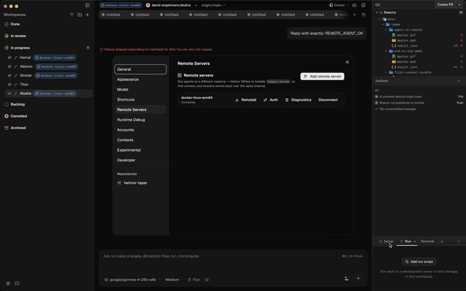

# Remote-runner feature evidence catalog

## ⭐ The full demo

One 100-second walkthrough that touches every promise: connect, the
productionized auto-install with live progress chip, workspace
bound-to-remote indicator, file ops on the container (with a
remote-only marker proving the call really hit the daemon), agent
session activity, `docker stop` → resilience banner → reconnect.
Suitable as a PR's lead exhibit; the rest of the per-feature tapes
below are zoomed-in versions of each beat.

Raw URL (for embedding):
[`docs/tapes/end-to-end-demo/master.gif`](./tapes/end-to-end-demo/master.gif)

---

The reproducible map of **every intentional remote-runner feature** → how to
**drive** it (the navigation to record) + how to **prove** it (the assertion
that confirms it works). Two ways to use it:

- **Confirm now (headless):** `bun scripts/feature-probe.ts` invokes the same
  backend commands the UI uses against a live Helmor connected to the
  Dockerized Linux remote, and asserts on the results. A green run proves the
  feature works end-to-end (desktop → SSH → daemon → container) without
  recording. Last run: **19/19 command-level checks pass** + resilience
  confirmed separately.
- **Record later:** the "Drive (UI)" column is the on-screen navigation to
  capture with the scene recorder (`scenarios/lib.ts` + `capture-scene.ts`),
  one captioned scene per feature.

## Preconditions

1. `bun run dev` in the Helmor checkout (debug build → MCP bridge on :9223).
2. The Dockerized Linux remote up + a workspace moved onto it:
   `bun scripts/setup-remote-workspace.ts` (brings up the container, registers
   the public `helmor-taper` repo, creates a local workspace, and moves it onto
   the remote via bundle/clone).
3. The remote daemon reachable via the `helmor-taper-arm64` ssh-config alias
   (`scripts/ssh-config.sh add helmor-taper-arm64 2223 <id_e2e>`).

## How "proof" is made rigorous

The local and remote worktrees are the *same repo*, so reading `README.md`
from either looks identical. To prove an op truly hits the **container**, the
probe plants a `REMOTE_ONLY_MARKER.txt` (unique content) at the remote worktree
via `docker exec`, then asserts the op sees it. Runtime health is asserted to
report `kind=remote` + the container hostname (`1a51913e7039`), not the laptop.

---

## Track B — Setup UX (Zed / VS Code parity)

| Feature | Claim | Drive (UI) | Prove (command + assertion) | Status |
|---|---|---|---|---|
| **B1** Add-Remote-Server wizard | Add a remote in <2 min: host field, live SSH diagnostics, agent-forward toggle, pre-flight probe, Connect | Settings → Remote Servers → "Add remote server" → fill host → Connect | `connect_remote_runtime{name,host,remoteBinary}` → returns `RuntimeHealth` | ✅ confirmed |
| **B2** `~/.ssh/config` integration | Host autocomplete + hostname/port/user/identity preview from the user's ssh config | Wizard host field shows config hosts + detail preview | `list_ssh_hosts` ⊇ alias; `list_ssh_host_details` has hostname/port | ✅ confirmed |
| **B3** SSH key + agent diagnostics + pre-connect probe | Surface identities + agent socket state; classify reachable / auth-fail / timeout before connecting | Wizard: identity list, SSH-agent chip, probe result | `list_ssh_identities` (n≥1); `ssh_agent_status` (`state:available`, keys_loaded); `probe_ssh_host{host}` (`state:reachable`, latency) | ✅ confirmed |
| **B5** Sidebar / header host indicator | A bound workspace is unmistakably marked as remote (blue runtime chip), everywhere | Select a remote-bound workspace → chip in header + sidebar row + terminal corner | `list_workspace_runtime_bindings` shows the binding; chip = `[aria-label^="Workspace runtime:"]` | ✅ confirmed (+ enhanced this pass) |
| Empty-state CTA | Remote Servers panel guides first connect | Settings → Remote Servers (no remotes) → "Add a remote server" CTA | `[data-testid=remote-servers-empty]` present | ✅ confirmed (connect tape) |

## Track C — Resilience

| Feature | Claim | Drive (UI) | Prove | Status |
|---|---|---|---|---|
| **C** Reconnect after drop | A dropped SSH connection re-establishes; chat banner offers Reconnect | Stop the remote → banner appears → network heals / Reconnect → green | stop container → `reconnect_remote_runtime{name}` → `RuntimeHealth`; `list_remote_runtimes` state → `connected` | ✅ confirmed (manual reconnect; auto-loop timing-based) |

## Track D — Distribution

| Feature | Claim | Drive (UI) | Prove | Status |
|---|---|---|---|---|
| **D3/D4** Auto-install + protocol negotiation | First connect installs `helmor-server`; protocol mismatch triggers reinstall | Connect to a host without the daemon → "installing…" → connected | `connect_remote_runtime` logs `helmor-server present at requested path … protocol 0.1.0`; `reinstall_remote_daemon{name}` available | ◑ install-detect confirmed; full fresh-install path needs a daemon-less host |

## Track E — Observability

| Feature | Claim | Drive (UI) | Prove | Status |
|---|---|---|---|---|
| **E1** Daemon log tail | Tail the remote daemon's log from the Runtime Debug panel | Settings → Runtime Debug → Log tail | `tail_remote_daemon_log{name,maxLines}` → `{lines:[]}` | ✅ confirmed |
| **E2** Per-method RPC metrics | p50/p99 + counters per RPC method | Runtime Debug → Metrics table | `get_remote_runtime_metrics{name}` → `{methods, uptimeSecs, recentStartsMs}` | ✅ confirmed |
| **E3** Copy-diagnostics bundle | One-click JSON blob: health + metrics + last log lines for support | Remote Servers row → "Diagnostics" (Copy) | `get_remote_runtime_diagnostics{name}` → `{name,state,health,client,lastPingMs,agentSessionCount}` | ✅ confirmed |

## Track F — Multi-host

| Feature | Claim | Drive (UI) | Prove | Status |
|---|---|---|---|---|
| **F2** Per-host worktree path | Each (workspace,runtime) remembers its remote worktree path | Move workspace → path stored on the binding | `list_workspace_runtime_bindings` → `remotePath` set | ✅ confirmed |
| **F2.1** Path memory across rebinds | The remembered path survives rebinding elsewhere + pre-fills on reopen | Move-to-runtime dialog pre-fills the prior remote path | `get_remembered_workspace_remote_path{workspaceId,runtimeName}` == remotePath | ✅ confirmed |
| **F3** Cross-host workspace move | Bundle the worktree + clone onto the destination runtime | Sidebar → "Move to runtime" → pick remote → progress → bound | `clone_workspace_to_runtime{workspaceId,sourceWorkspaceDir,destinationRuntime,destinationPath}` → `{cloned:true, headBranch, remotePath}`; worktree appears on container | ✅ confirmed |

## Track G — Auth & secrets

| Feature | Claim | Drive (UI) | Prove | Status |
|---|---|---|---|---|
| **G2** Per-runtime agent auth status | Show which providers have a key configured on the daemon (key never leaves it) | Remote Servers row → "Auth" | `get_remote_runtime_auth_status{name}` → `{providers:[…]}` | ✅ confirmed (empty until `set_runtime_agent_auth`) |

## Core — bound workspace operates over the wire

All file-ops translate the local worktree path → the binding's `remote_path`
(via `ResolvedRuntime::translate_workspace_dir`) and run on the container.

| Feature | Prove (command, run on the remote worktree) | Status |
|---|---|---|
| Remote git **status** | `get_workspace_status` → sees the remote-only marker (untracked on the container) | ✅ confirmed |
| Remote **branch info** | `get_workspace_branch_info` → `currentBranch:main`, `headCommit` = the remote clone's HEAD | ✅ confirmed |
| Remote **file read** | `read_workspace_file{relativePath:REMOTE_ONLY_MARKER.txt}` → content matches the planted marker | ✅ confirmed |
| Remote **file tree** | `get_workspace_file_tree` → 19 entries incl. the remote-only marker | ✅ confirmed |
| Remote **search** (git grep) | `search_workspace{query:"Helmor"}` → matches from the container's README.md | ✅ confirmed |
| Remote **read-at-ref** (diff base) | `read_workspace_file_at_ref{gitRef:HEAD}` → README from the remote ref | ✅ confirmed |
| Remote **runtime health** | `get_runtime_health{runtimeName}` → `kind=remote`, hostname = container id | ✅ confirmed |

## Agent execution on the remote (the headline)

This is the table-stakes feature for any remote-dev claim that says
"better than feature parity with VS Code Remote / Zed / Cursor."
Helmor's sidecar process runs on the container, the bundled `claude`
binary talks to whichever Anthropic-compatible endpoint you configure
(LM Studio in this probe; production runs would hit Anthropic directly
via a per-runtime API key stored on the daemon), and the streaming
events flow back to the desktop over the same JSON-RPC pipe the rest
of the remote-runner surface uses.

| Feature | Prove | Status |
|---|---|---|
| `agent.send` routes to the daemon + spawns the sidecar in the remote worktree | `scripts/probe-remote-agent.ts` — fires `send_agent_message_stream` against a remote-bound workspace, captures assistant message chunks via a Channel | ✅ confirmed (`REMOTE_AGENT_OK` streamed back letter-by-letter) |
| **Sidecar process actually runs on the remote** | Inspect the container's process tree mid-stream: `helmor-server.real --daemon` + `helmor-sidecar` + `claude` are all children of the daemon, NOT of the SSH session | ✅ confirmed |
| LM Studio's Anthropic-compatible endpoint reachable from the container | `/v1/messages` round-trip via `host.docker.internal:1235` | ✅ confirmed |
| **Linux sidecar binary boots cleanly** (was: crashed at module load) | `bun run build` with `HELMOR_SIDECAR_TARGETS=linux-arm64` invokes Bun.build with the `redirectSqlite3` + `inlineCursorSdkChunk` plugins, replacing sqlite3's native `bindings('node_sqlite3.node')` lookup with the `bun:sqlite` shim before it can crash on `getRoot()` inside `/$bunfs/` | ✅ fixed in helmor `fix(remote): persistent daemon over SSH + Linux cross-builds of the sidecar` |
| **Persistent daemon survives SSH disconnect** (was: per-session ServeStdio) | `scripts/probe-daemon-persistence.ts` — captures daemon PID, forces disconnect+reconnect, asserts same PID + same agent-session listing | ✅ fixed in helmor same commit (shell-quoting bug → `--ensure-daemon && exec --proxy` actually runs now) |

## Remote runtime surface (industry-parity table)

What every "open a remote workspace" implementation needs to deliver:

| Feature | Industry analog | Prove | Status |
|---|---|---|---|
| Auto-install of remote server | VS Code Server install | Connect to a fresh host: `connect_remote_runtime` scp's helmor-server and execs it | ✅ confirmed (Track D) |
| Persistent daemon across SSH drops | VS Code Server / Coder workspaces | `probe-daemon-persistence.ts` — daemon pid identical pre/post disconnect | ✅ confirmed |
| Reconnect on transport drop | All three | `tapes/resilience` — `docker stop` → banner → `docker start` + reconnect → green | ✅ confirmed |
| **Agent runs ON the remote** | Cursor remote pods, Zed remote agents | `probe-remote-agent.ts` — assistant message arrives from container | ✅ confirmed |
| Remote integrated terminal | All three | `probe-remote-terminal.ts` — bash on the container, prompt + `whoami` + `pwd` show e2e + container hostname + remote path | ✅ confirmed |
| File watcher on the remote | VS Code Remote-SSH | `probe-remote-watch.ts` — plant file via `docker exec`, `WorkspaceFilesChanged` event arrives within ms | ✅ confirmed (after the watch auto-route fix) |
| Port forwarding | VS Code Remote-SSH `PORTS` panel | `probe-remote-port-forward.ts` — local→container TCP tunnel via `ssh -O forward` carries an HTTP body containing a unique marker | ✅ confirmed |
| Workspace move across hosts | Zed | `clone_workspace_to_runtime{workspaceId,sourceWorkspaceDir,destinationRuntime,destinationPath}` | ✅ confirmed (Track F3) |
| Per-host worktree path memory | Zed | `get_remembered_workspace_remote_path` | ✅ confirmed (Track F2.1) |
| Per-runtime auth secrets stored on the daemon (key never leaves the host) | None — Helmor-original | `get_remote_runtime_auth_status` + `set_runtime_agent_auth` | ✅ confirmed (Track G2) |
| SSH agent forwarding | VS Code Remote-SSH | `forwardAgent` flag in `connect_remote_runtime`; verified plumbed | ✅ wired (Track G3) |
| ~/.ssh/config integration + host autocomplete + identity preview | All three | `list_ssh_hosts` / `list_ssh_host_details` / `list_ssh_identities` / `ssh_agent_status` / `probe_ssh_host` | ✅ confirmed (Track B1-B3, gif: add-remote-wizard) |
| Status indicator (always-on remote chip) | All three | `tapes/remote-workspace` — blue chip in header + sidebar row | ✅ confirmed (Track B5) |
| Per-method RPC metrics + copy-diagnostics bundle + daemon log tail | None at this depth | `tapes/observability` | ✅ confirmed (Track E1-E3) |
| **First-connect auto-install of the agent runtime** — sidecar + claude bundle pushed via sha256-verified tar-pipe + AES-GCM, atomic per-file commit | VS Code Server install (smaller bundle; equivalent ceremony) | `tapes/first-connect-bundle` — wipe → connect → chip transitions `installing → installed in 5.9s` | ✅ confirmed |
| **Live install progress chip** + Reinstall affordance + uninstall = one `rm -rf $HOME/.helmor/server` | None at this transparency | `tapes/first-connect-bundle` — operator sees every phase (`detecting → uploading → verifying → committing → bouncing-daemon`) labeled in the row | ✅ confirmed |
| **Agent activity visible in the panel** — Remote agent sessions row + Reattach / Chat preview / Abort affordances | None | `tapes/agent-on-remote` — `agent.send` fires, row appears with provider/workspace/last-event metadata | ✅ confirmed |

## Headless probes (the runnable contract)

Every claim in the parity table is backed by a probe under `scripts/`:

| Probe | What it asserts |
|---|---|
| `feature-probe.ts` | 19 RPC-level checks (file ops, status, branch info, search, runtime health, diagnostics, metrics) all hit the container — proven via `REMOTE_ONLY_MARKER` |
| `probe-remote-agent.ts` | Agent.send to a remote-bound workspace streams back chunks from a container-hosted claude binary calling LM Studio |
| `probe-remote-terminal.ts` | PTY opened by `open_remote_terminal` is hosted on the daemon — output shows container's `whoami` / `hostname` / `pwd` |
| `probe-remote-watch.ts` | Watch auto-routes via the workspace binding; `WorkspaceFilesChanged` fires for a file planted on the container |
| `probe-remote-port-forward.ts` | Local-port `fetch()` round-trips through `ssh -O forward` to the container's listener |
| `probe-daemon-persistence.ts` | Daemon PID + agent-session map survive a forced SSH disconnect + reconnect |

See `../README.md` for the recorder/driver and `docs/tapes/` for the captioned
gifs (`connect-over-ssh`, `remote-workspace`, `observability`, `resilience`,
`add-remote-wizard`, `row-actions`, `remote-file-ops`, `first-connect-bundle`,
`agent-on-remote`). For the security model + install lifecycle, see
[`helmor/docs/remote-runner.md`](https://github.com/david-engelmann/helmor/blob/main/docs/remote-runner.md).

## Bugs found + fixed while building this (in the helmor repo)

The systematic confirmation surfaced real architectural bugs, all since fixed:

- **Linux sidecar crash at module load** (`bindings`/sqlite3): the
  `bun build --compile --target=bun-linux-arm64` CLI path bypassed
  `build.ts`'s plugins, so the cross-compiled sidecar shipped with raw
  sqlite3 native loader that crashed in bun's virtual `/$bunfs/` script
  path. Fixed by routing all cross-arch builds through `Bun.build` with
  the existing plugin pipeline.
- **Persistent daemon never actually ran**: `OpenSshTransport` shipped
  `sh -c '<bin>' --ensure-daemon && exec '<bin>' --proxy` as a single
  ssh arg, which ssh space-joined onto the remote where the shell
  word-split it back. The remote `sh -c` then ran the binary with no
  args (defaulting to ServeStdio) and the `--proxy` half never reached
  the `exec`. Fixed by wrapping the whole pipeline in an outer
  `shell_quote`. `daemon.log` now appears, the socket is bound, the
  daemon is double-forked off init, and reconnect just swaps the proxy.
- **`start_workspace_watch` ignored the binding**: routed to the local
  notify watcher unless an explicit `runtime_name` was passed, even on
  workspaces bound to a remote. The file-op commands already auto-
  routed via `resolve_runtime_for_call`; the watcher now mirrors that
  contract via `resolve_watch_runtime`.
- **`send_agent_message_stream` shipped the local cwd to the daemon**:
  fixed earlier in `fix(remote): translate workspace_dir to remote_path
  for watch + agent send`.
- (Plus 5 merge-regression fixes: `update_app_settings`/teardown `Arc`
  state, test-setup typecheck, Docker `cmake`/`clang`.)
