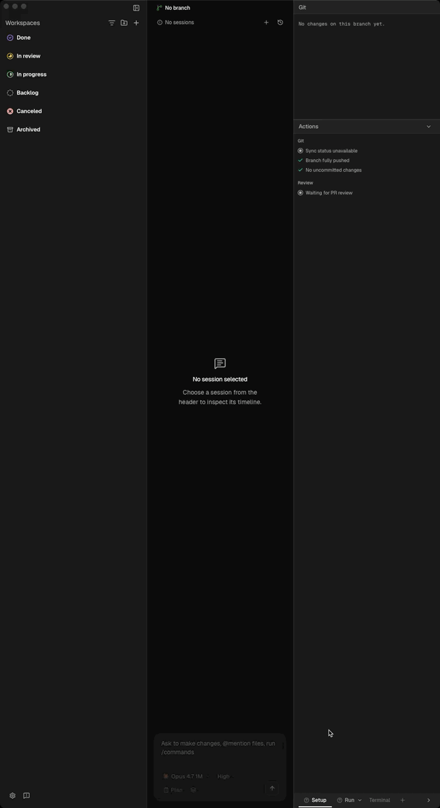

# Tape: remote-runner

Helmor desktop connecting to a Dockerized Linux host running
`helmor-server` over SSH, recorded against a live debug build.

- **Result:** PASS
- **Host:** `helmor-taper-arm64` (docker `helmor-test-linux-arm64`, ssh :2223)
- **Remote daemon:** `/home/e2e/.helmor/server/helmor-server`
- **Recorded:** 2026-05-27T16:21:47Z



<video src="master.mp4" controls width="720"></video>

## Artifacts

| File | What |
|---|---|
| `master.mov` | ScreenCaptureKit window capture (source) |
| `master.mp4` | browser-friendly H.264 |
| `master.gif` | markdown-embeddable loop |
| `result.json` | RuntimeHealth + programmatic assertions |
| `scenario.log` / `record.log` | per-stage logs |

## Assertions

```json
{
  "connectMs": 410,
  "health": {
    "hostname": "1a51913e7039",
    "kind": {
      "host": "helmor-taper-arm64",
      "type": "remote"
    },
    "version": "0.26.0"
  },
  "assertions": [
    {
      "name": "panel_opens",
      "ok": true,
      "detail": "dialogs=1"
    },
    {
      "name": "starts_empty",
      "ok": true,
      "detail": "no remote servers yet"
    },
    {
      "name": "ssh_connect_succeeds",
      "ok": true,
      "detail": "410ms"
    },
    {
      "name": "daemon_reports_remote",
      "ok": true,
      "detail": "{\"host\":\"helmor-taper-arm64\",\"type\":\"remote\"}"
    },
    {
      "name": "daemon_reports_version",
      "ok": true,
      "detail": "v0.26.0"
    },
    {
      "name": "daemon_reports_hostname",
      "ok": true,
      "detail": "1a51913e7039"
    },
    {
      "name": "ui_shows_connected_row",
      "ok": true,
      "detail": "docker-linux-arm64 | Connected | Auth | Diagnostics | Disconnect | "
    },
    {
      "name": "row_says_connected",
      "ok": true,
      "detail": "docker-linux-arm64 | Connected | Auth | Diagnostics | Disconnect | "
    },
    {
      "name": "backend_runtime_connected",
      "ok": true,
      "detail": "{\"type\":\"connected\"}"
    }
  ],
  "passed": true
}
```
